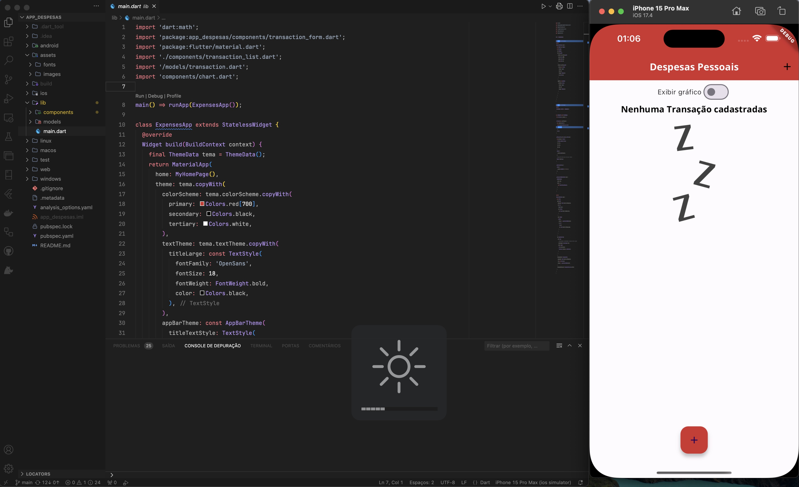

# MyVSCodeSettings

Este é um repositório apenas para demonstrar as minhas configurações do meu VSCode e do meu terminal no macbook

## Layout

  

## Resumo 

O meu VSCode está configurado de forma minimalista, com poucos detalhes que tiram a concentração na hora de desenvolver.
Todas as configurações foram feitas através [deste vídeo](https://youtu.be/TW3KoPkuWEA?si=0p6asP3so4cf9CYI). Neste vídeo ele demonstra o porque ele fez cada modificação no VSCode
Além das modificações feitas no vídeo, também configurei o VSCode com as minhas necessidades para Dart, Flutter e Python.

## Como usar essas configurações

Para copiar as minhas configurações é simples: <br>

1. Abra o arquivo [MyVSCodeSettings](https://github.com/ArthurRCastilho/MyVSCodeSettings/blob/main/MyVSCodeSettings.json)
2. Copie todo o código
3. No seu VSCode abra as configurações do seu VSCode da seguinte forma
```
    MacOS:
    CMD+Shift+P

    Windows:
    Cntrl+Shift+P
```
Digite a seguinte frase na barra de pesquisa que aparecer:
```
    Abrir as Configurações do Usuário (JSON)
```
4. Cole todo o código de [MyVSCodeSettings](https://github.com/ArthurRCastilho/MyVSCodeSettings/blob/main/MyVSCodeSettings.json)
5. Salve o arquivo json e reinicie o seu VSCode

# Terminal

Para ver as configurações do Terminal veja o arquivo [TERMINAL.md](https://github.com/ArthurRCastilho/MyVSCodeSettings/TERMINAL.md/)
