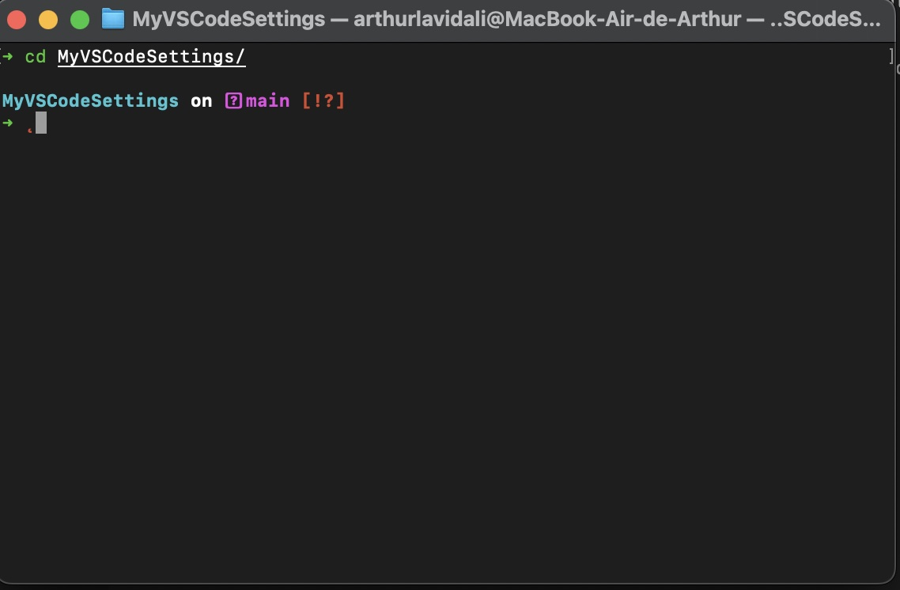
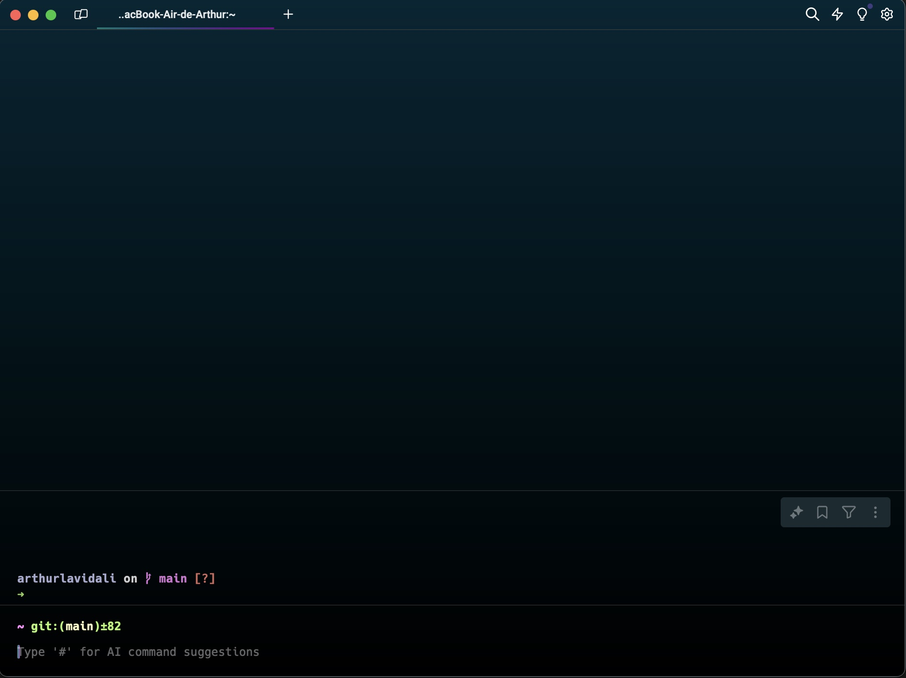
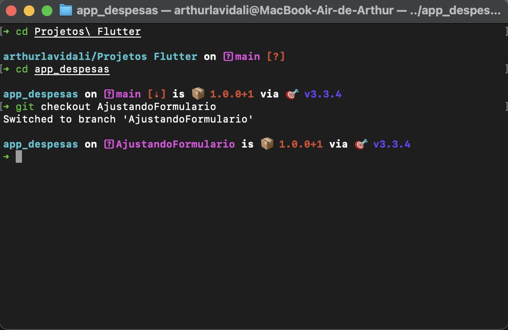

# Terminal

Atualmente estou utilizando OhMyZsh com 2 plugins: autosugestation e sytax-highlights, além do tema spaceship prompt, que auxilia muito na produtividade.<br>

Essas configurações funcionam para todos os terminais do Macbook que sejam Zsh. *Não funcionam para Windows*

Todas as configurações foram feitas através [deste vídeo](https://youtu.be/bs1-Wxb_KIc?si=3nK634XFxsa-VxOd)

## Layout

   

## Como instalar o terminal

1. Para começar, instale o [Homebrew](https://brew.sh/) caso você não tenha instalado em seu mac
```
    /bin/bash -c "$(curl -fsSL https://raw.githubusercontent.com/Homebrew/install/HEAD/install.sh)"
```
2. Agora faça a instalação do [Oh My Zsh](https://ohmyz.sh/) - (Para instalar viu wget, é necessário instalar wget no seu mac via brew)

Via curl:
```
    sh -c "$(curl -fsSL https://raw.githubusercontent.com/ohmyzsh/ohmyzsh/master/tools/install.sh)"
```
Via wget:
```
    sh -c "$(wget https://raw.githubusercontent.com/ohmyzsh/ohmyzsh/master/tools/install.sh -O -)"
```
3. Feito isso o seu Oh My Zsh aparecerá uma mensagem grande no terminal confirmando a instalação. Feche o terminal e abra novamente.
4. Seu Oh My Zsh já está funcionando, os plugins são opcionais.


## Como instalar os Plugins

### Syntax-Highlights
[Repositorio](https://github.com/zsh-users/zsh-syntax-highlighting/tree/master)

1. Clone o repositorio
```
git clone https://github.com/zsh-users/zsh-syntax-highlighting.git ${ZSH_CUSTOM:-~/.oh-my-zsh/custom}/plugins/zsh-syntax-highlighting
```

2. Ative o plugin em nano ~/.zshrc com o seguinte comando
```
plugins=(git [plugins] zsh-syntax-highlighting)
```

3. Reinicie o terminal

### Autosuggestion
[Repositorio](https://github.com/zsh-users/zsh-autosuggestions/tree/master)

1. Clone o repositorio
```
git clone https://github.com/zsh-users/zsh-autosuggestions ${ZSH_CUSTOM:-~/.oh-my-zsh/custom}/plugins/zsh-autosuggestions
```

2. Ative o plugin em nano ~/.zshrc com o seguinte comando
```
plugins=( 
    # other plugins...
    zsh-autosuggestions
)
```

3. Reinicie o terminal


### Tema: Spaceship prompt
[Repositorio](https://github.com/spaceship-prompt/spaceship-prompt)

1. Clone o repositorio
```
git clone https://github.com/spaceship-prompt/spaceship-prompt.git "$ZSH_CUSTOM/themes/spaceship-prompt" --depth=1
```

2. Coloque o seguinte comando no terminal
```
ln -s "$ZSH_CUSTOM/themes/spaceship-prompt/spaceship.zsh-theme" "$ZSH_CUSTOM/themes/spaceship.zsh-theme"
```

4. Após isso é só setar o thema dentro de nano ~/.zshrc
```
ZSH_THEME="spaceship"
```

5. Reinicie o Terminal

### Conclusão
Desta forma você tem um terminal configurado e colorido :)
